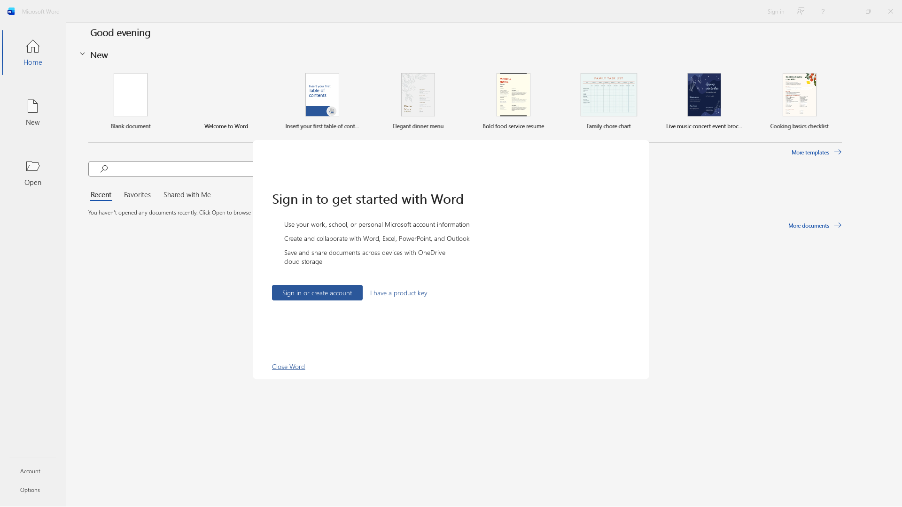

# 让 Microsoft 365 跑起来

从零开始，到 Word、Excel、PowerPoint 用你自己的微软账号登录完成。
（English: [getting-started.md](getting-started.md)。）

耗时：40–90 分钟，大部分是微软安装器下载约 2–3 GB 的时间。
磁盘：安装过程中约需 10 GB 空闲，装完后约占 6 GB。

先说清楚哪些验证过、哪些没有，免得你信错地方：

* 整个流程——`office-setup.sh all`（前缀、WebView2 运行时、用微软自己的安装器装 Word、登录开关）加上启动 Word——由
  [`office-smoke.yml`](../.github/workflows/office-smoke.yml) 在干净的 GitHub runner 上、用发布版 Wine 跑过。它停在该停的地方：
  下面截图里的登录提示。它没法登录，因为那需要一个有订阅的真人。
* 登录以及随后的授权，是笔记（[`office365-under-wine.md`](office365-under-wine.md)）里记录的流程，当时在同一个 Wine 上手工完成，
  用的是个人版 Microsoft 365 Family/Personal 订阅。

## 0. 你需要什么

* 一份挂在**个人微软账号**上的 **Microsoft 365 订阅**。测过 Family 和 Personal。面向企业/商业的 Microsoft 365 Apps（`O365ProPlusRetail`）
  安装方式相同，但没有试过；工作或学校账号同样没试过。没有订阅，Office 在这里和在 Windows 上一样不会给自己授权。
* 带图形会话（X11，或 Wayland 加 Xwayland）和可用 OpenGL 驱动的 x86-64 Linux。没有 GPU 的虚拟显示用来安装没问题，用来看结果就不行。
* `curl`、`git`，以及常见的 Wine 运行时库。装发行版自带的 `wine` 包是最省事的拿到这些库的办法；你不会用到那个 Wine。

## 1. Wine

要么取[最新发布版](https://github.com/Altars3668/wine-altars/releases/latest)（Ubuntu 24.04 构建，需要 glibc 2.39 或更新）：

```sh
curl -LO https://github.com/Altars3668/wine-altars/releases/latest/download/wine-altars-linux-x86_64.tar.xz
sudo tar -C /opt -xf wine-altars-linux-x86_64.tar.xz
export PATH=/opt/wine-altars/bin:$PATH
wine --version
```

要么自己构建（[`building.md`](building.md)）。下面所有步骤都用*这个* Wine：别的 Wine 建出的前缀装的是另一套系统 DLL 副本，
之后 Office 会无声地失败。如果系统里还有别的 Wine，确认 `which wine` 打印的是 `/opt/wine-altars/bin/wine`，或者给每个脚本设置
`WINE=/opt/wine-altars/bin/wine`。

## 2. 脚本

```sh
git clone https://github.com/Altars3668/wine-altars.git
cd wine-altars
export WINEPREFIX=$HOME/.wine-office       # 默认值；任何空目录都行
scripts/office-setup.sh status
```

`status` 会打印哪些已就绪、哪些还缺；拿不准时随时运行。`scripts/` 下的脚本都从环境变量读取 `WINE`（wine 可执行文件）和 `WINEPREFIX`；
在你工作的 shell 里导出一次即可。

## 3. 四个步骤

`scripts/office-setup.sh all` 按顺序运行它们。第一次建议一条一条跑。

### `prefix` —— 64 位、Windows 11 模式的前缀

创建 `$WINEPREFIX`，设为 Windows 11（Office 要求前缀这样报告），并从 Wine 自己的下载站安装 Wine Gecko 2.47.4。不安装 Mono 和 .NET：
Office 本身不需要它们（Excel 的 Power Query 和 VSTO 加载项需要，那不在这份快速开始的范围内）。准备步骤运行时关闭了 Wine 的菜单生成器，不会在你的桌面上留下东西。

### `webview2` —— 微软的内嵌浏览器

Office 的登录窗是一个 WebView2 浏览器。这一步下载微软的引导程序并静默运行（`/silent /install`），然后施加 `winetricks webview2` 为 Wine 的
53925 与 58921 两个缺陷所施加的两个规避（更新服务不能自动启动；渲染进程要被告知“你在 Windows 7 上”）。这个引导程序是 32 位程序，
这就是 Wine 构建要带 32 位一半的原因。耗时几分钟。

### `install` —— Office 本体

下载微软的 Office 安装器（`setup.exe`，7 MB，来自 `officecdn.microsoft.com`），写出配置，运行 `setup.exe /configure`。装什么由环境变量决定：

| 变量 | 默认值 | |
|---|---|---|
| `OFFICE_PRODUCT` | `O365HomePremRetail` | **必须与你的订阅匹配。** `O365HomePremRetail` 是 Microsoft 365 Family/Personal。装错产品能装上，但之后无法授权 |
| `OFFICE_LANG` | `en-us` | `zh-cn`、`de-de` 等 |
| `OFFICE_APPS` | `word,excel,powerpoint` | 可加 `outlook`、`onenote`、`access`、`publisher`，风险自负——没测过 |
| `OFFICE_CHANNEL` | `Current` | |

```sh
OFFICE_LANG=zh-cn scripts/office-setup.sh install        # 中文界面
```

生成的配置在运行前会打印出来，并保存在 `~/.cache/wine-altars/`；`DRY_RUN=1` 在打印后停下。`setup.exe` 本身什么也不打印；脚本每分钟报告一次
`Program Files\Microsoft Office` 的大小，微软安装器的日志写在 `$WINEPREFIX/drive_c/c2rlog/`。配置里关闭了 Office 自动更新，Office 不会在你不知道时变化；
就地更新没有测过。

运行 `install` 即表示你接受微软的许可条款：配置里写着 `AcceptEULA="TRUE"`。还没读过的话请先读。

### `signin` —— 让 Office 使用它自己的登录窗

给每个 Office 应用写入两个当前用户的注册表值
（`HKCU\Software\Microsoft\Office\16.0\Common\ExperimentConfigs\ExternalFeatureOverrides\<app>`）：

```
Microsoft.Office.Identity.FG.IsWebView2ForOneAuthEnabled      = true
Microsoft.Office.Identity.TestGate.DisableBrokerForOneAuth    = true
```

两者都是 Office 自己的覆盖机制；它们选择运行*哪一套*登录实现，不碰任何许可证或授权状态。第一个让 Office 的登录页使用 WebView2
（默认情况下它退回旧的浏览器引擎，把微软的页面渲染成一个空元素）。第二个告诉它不要经由 Windows 账户 broker 登录——Wine 无法完整提供它。
名字必须带完整的 `Microsoft.Office.Identity.` 前缀，写短了会被无声忽略。

## 4. 第一次启动与登录

```sh
scripts/office-setup.sh launch word
```

冷启动要几十秒。Word 带着开始页起来，并弹出一个对话框，标题 *Sign in to set up Office*，正文 *Sign in to get started with Word*，
有一个 *Sign in or create account* 按钮；标题栏右上角还有一个 *Sign in* 链接（界面语言不同，文字不同）。干净 runner 上的测试看到的就是下面这样：



**用鼠标点。** Office 自己的按钮对无障碍接口的
“按下”请求回答“完成”，却什么也不做——这会让脚本化点击看起来像是 Office 坏了——但真实点击是有效的。同一个入口还有 *文件 → 账户 → 登录*。

会打开一个标题为 *Sign in* 的窗口，约 450×520 像素。里面全是微软的页面：

1. 输入持有订阅的账号的邮箱地址；
2. 密码，以及该账号设置了的二次验证；
3. 微软若还问别的（同意页面、是否记住账号），像在 Windows 上一样回答；
4. 窗口关闭，Word 显示开始页。

查看 *文件 → 账户*：产品应显示为已激活，账号是你的。请正常关闭 Word（*文件 → 退出*）——非正常退出会让 Office 下次提示安全模式。
登录结果存在前缀里（用 Wine 自己的 DPAPI 密钥封存），重启后仍然有效；每个前缀只需登录一次。

出问题时该读的是 Office 自己的诊断日志：`$WINEPREFIX/drive_c/users/<你>/AppData/Local/Temp/Diagnostics/WINWORD/` 下以制表符分隔的文本文件，
里面用大白话写着失败的步骤（`FullValidation`、`Entitlement`、`OneAuth…`）。**它也含有你的账号标识；分享前请先涂掉。**

## 5. 日常使用

* 用 `scripts/office-setup.sh launch word|excel|powerpoint` 启动应用，或者用你的 Wine 直接运行
  `$WINEPREFIX/drive_c/Program Files/Microsoft Office/root/Office16/WINWORD.EXE`。Office 是单实例的：第二次启动会把请求交给已在运行的实例然后退出。
  如果有个实例卡在你没看着的显示器上，再点图标不会有反应；用同一个 `WINEPREFIX` 执行 `wineserver -k` 即可清掉。
* 不会创建菜单项；请自己做一个运行上面命令的启动器。
* 换用另一个 Wine 构建后，前缀会在下次启动时自行更新（一分钟左右）。更新进行时不要启动 Office。
* 打印经 CUPS 和 Wine 的 PostScript 驱动。对没有双面器的打印机，有一条手动双面通路（补丁系列中的 0030、0042、0060；用捕获的打印输出验证过，
  尚未用真纸验证）。`tools/cups-manual-duplex` 能为它配置一个 CUPS 队列，它的 README 写明了具体改了什么。

## 6. 不工作时

| 现象 | 可能的原因与处理 |
|---|---|
| 登录窗空白，或者一打开就关 | 开关没设或 WebView2 运行时缺失：`scripts/office-setup.sh status`，然后 `signin` / `webview2`。或者在用的 Wine 不是这个构建（缺少 broker 补丁） |
| Office 说*无法访问你的账户*，且不给登录表单 | 从别的机器拷来的登录数据：`…/AppData/Local/Microsoft/OneAuth` 与 `IdentityCache` 被那台机器的密钥封住。把这两个目录移开，再启动 Word。永远不要在机器之间拷贝它们 |
| 登录后 Office 说订阅不包含这个产品 | 安装的产品与订阅不匹配。换一个新前缀，用正确的 `OFFICE_PRODUCT` 重来 |
| 对话框说无法验证产品许可证，且只有*确定* | Office 尚未授权。按*确定*会**退出 Office**，在 Windows 上也如此。重新启动，从首次运行对话框或 *文件 → 账户* 登录。这个对话框出现时独占键盘，不要往它后面的文档里打字 |
| Word 启动时提示*安全模式* | 上次不是正常退出。选*否*（*是/否*按钮是普通的 Windows 消息框） |
| 点图标没反应 | 之前的实例被藏起或卡住了：`wineserver -k`，再启动 |
| `setup.exe` 退出码不是 0 | 看 `$WINEPREFIX/drive_c/c2rlog/*.log` 里最后一条 `Error`。常见原因是磁盘空间（10 GB）以及用的 Wine 不是这个构建。再运行一次 `install`；仍旧同样失败就换新前缀 |
| PowerPoint 报*内存或系统资源不足* | PowerPoint 加载了 Wine 自带的小号 `riched20`，没有用 Office 自己带的那个。`wine reg add 'HKCU\Software\Wine\DllOverrides' /v riched20 /t REG_SZ /d native,builtin /f`。这是在“从 Windows 拷来的 Office”上测的，没有在全新安装上测过；如果对你有效，笔记希望知道 |
| WebView2 窗口一片纯黑 | 你在没有 GPU 的显示上（Xvfb）。换成真实的 X11 或 Xwayland 会话 |
| 点击、键入或脚本化输入到不了 Office | 通过无障碍接口按按钮的脚本对 Office 自绘的控件无效；请用真实输入（鼠标，或 X11 上的 `xdotool`） |

## 7. 重来

先关掉 Office，再 `wineserver -k`，然后删掉前缀：`rm -rf "$WINEPREFIX"`。除了 `~/.cache/wine-altars/` 和 `~/.cache/wine/`（Wine 自己的附加组件缓存）里的下载文件，
没有改动你系统的其他地方，这两处可以安全删除。

## 8. 继续阅读

* [`office365-under-wine.md`](office365-under-wine.md) —— 实验笔记：每一次测量，按先后顺序，包括走错的路。很长，按症状搜索。
* [`method.md`](method.md) —— 用到的仪器，以及已经踩过的坑。
* [`../patches/altars-up/README.md`](../patches/altars-up/README.md) —— 补丁系列。
